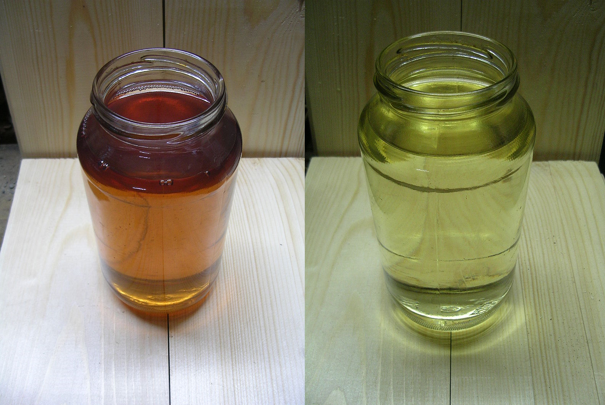
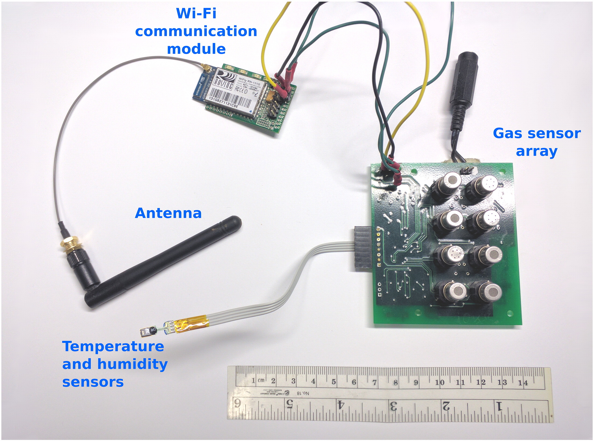

# Mini-project summary

In this mini-project, an LSTM model is used to process data from an electronic nose to discriminate between the gaseous signatures of banana, wine and background (neither banana nor wine) with an accuracy of over **99%** on a test dataset. A significant improvement on the 81% accuracy achieved by **Huerta et al (2016)** ([preprint on arXiv](https://arxiv.org/pdf/1608.01719.pdf)), who provided the dataset to the public.

# Prologue

## Gas Discrimination
Gas discrimination task involves identifying and differenting various gases or gasoues stimuli. There are simpler examples like detecting carbon monoxide in indoor air, and hydrogen sulphide in a mining site, and there more challenging ones like differentiating the gasoues stimuli of a pool of diesel fuel from that of a pool of gasoline (which can be important as the latter is much more flammable than the former as it has a much lower flash point). Such gas discrimination tasks can be tackled using an **electronic nose**.

<i><b>Gasoline (right) is much more flammable than diesel fuel (left). Each produces a rich mixture of hydrocarbon gases that gives it a distinct gaseous signature and also its scents.</b></i>

This subfield rapid chemical analysis is also beginning to intersect with robotics, as electronic noses are becoming vital instruments for robots to have, especially those deployed in hazardous environments. Traditional techniques of discriminating gases, like gas chromatography, often take hours to run and are therefore not suitable (Fan et al 2019).
 
Accurate discrimination of gases in a quick, cost-efficient manner remains a  challenging problem that's still actively being researched from multiple angles (lots of papers every year), like developing better sensors, better pattern recognition algorithms, expanding our understanding of the physical processes involved in the transduction of chemical signatures to electrical signals, etc.

## Electronic nose
An electronic nose setup is an array of gas sensors, often with mix of cross sensitive and selective sensors, that are used to identify chemical signatures that could be made up of an assorted mixture of gases. Cross sensitive sensors respond to multiple target gases while strictly selective sensors respond to one target gas (often very hard to achieve).

Electronic noses are useful instruments for human monitoring purposes, environmental analysis, atmospheric hazard prevention, breath analysis, etc.

<i><b>An electronic nose setup that includes 8 metal-oxide gas sensors (Huerta et al 2016).</b></i>

### Metal-oxide (MOX) gas sensors

Metal-oxide (MOX) sensors are one of the most common type of gas sensors. They cheap to make, easy to use and relatively very stable.

When a target gas comes in contact with the sensing surface of a MOX gas sensor, the oxygen already [adsorbed](https://en.wikipedia.org/wiki/Adsorption) to the sensing surface reacts with the target gas and causes a change in the electrical resistance of the sensor (a.k.a. the gas sensor response). This resistance is recorded and then used to determine the concentration of the target gas using a sensitivity characteristics chart (a chart relating resistance to concentration of the target gas).

## Sensing chemical signatures using an electronic nose

Unlike individual sensors that can be easily calibrated by following established standards (e.g. manufacturer's instructions), gas sensor arrays often require multivariate models to correctly map the sensor responses (electrical resistance values) to the gas concentration or some other desired property, e.g. identity of a gaseous stimulus.

The need for data processing and models often make calibrating electronic noses challeneging. Moreover, gas sensor responses are highly sensitive to temperature and humidity; and humidity itself varies with temperature (humidity decreases as temperature rises even when the water content of air or the ambient gas is unchanged), further complicating the relationship. 

To further complicate the challenge, gas sensors are prone to drift, which is a change of their characteristics over time even when under constant physical and chemical conditions (Holmberg et al 1997). All these makes it important for the model that interprets the readings of an electronic nose to be robust and agile.

# References

Fan, H., Hernandez Bennetts, V., Schaffernicht, E., & Lilienthal, A. (2019). Towards Gas Discrimination and Mapping in Emergency Response Scenarios Using a Mobile Robot with an Electronic Nose. *Sensors*. https://doi.org/10.3390/s19030685

Holmberg, M., Davide, F., Di Natale, C., D'Amico, A., Winquist, F. & Lundström, I. (1997). Drift counteraction in odour recognition applications: life long calibration method. *Sensors and Actuators B: Chemical*: https://doi.org/10.1016/j.chemolab.2016.07.004.

Huerta, R., Mosqueiro, T., Fonollosa, J., Rulkov, N., & Rodriguez-Lujan, I. (2016). Online decorrelation of humidity and temperature in chemical sensors for continuous monitoring. *Chemometrics And Intelligent Laboratory Systems*: https://doi.org/10.1016/j.chemolab.2016.07.004

# Introduction to the mini-project

This mini-project is inspired by the work done by Huerta et al (2016) (preprint on arXiv).

They demonstrated a method to improve gas discrimination by first filtering out the effects of environmental humidity and temperature from the gas sensor responses and using that to train an inhibitory support vector machine (I-SVM) that performs the discrimination.

The discrimination task was to use an electronic nose made of 8 metal-oxide gas sensors to differentiate three different gaseous stimili: wine, banana, and background (i.e. neither banana nor wine). Their paper excellently describes it as follows:

Rather than using the particular chemical signatures of compounds from bananas and wines, our goal is to construct a model that learns to predict presence of banana/wine based on the multivariate response of the sensors. The chemical signature of bananas changes, for instance, as they ripen, and wine's signature depends on alcohol content (ethanol), origin of the grape, among other factors. Thus, our approach attempts at building a model that does not rely on wine type and banana ripeness.

They used a theory-based model that exploits the fact that sensor responses depend on the changes of energy bands of the sensing surface, and the changes in the energy bands in turn arise from variations in environmental humidity and temperature.

Their theory-based, energy band model computes resistance values based on just changes in environmental humidity and temperature, and by subtracting this output from the actual resistance values measured by the electronic nose, they filter out the impact of changes in environmental humidity and temperature from the sensor readings.

By using these filtered signals, instead of the original signals, as an input to an I-SVM model, they were able to improve the perfomance of the gas discrimination task from 71.1% to 80.9%.

Upon reading their paper, I wondered in what ways can this be improved? See the Jupyter Notebook for more details.
